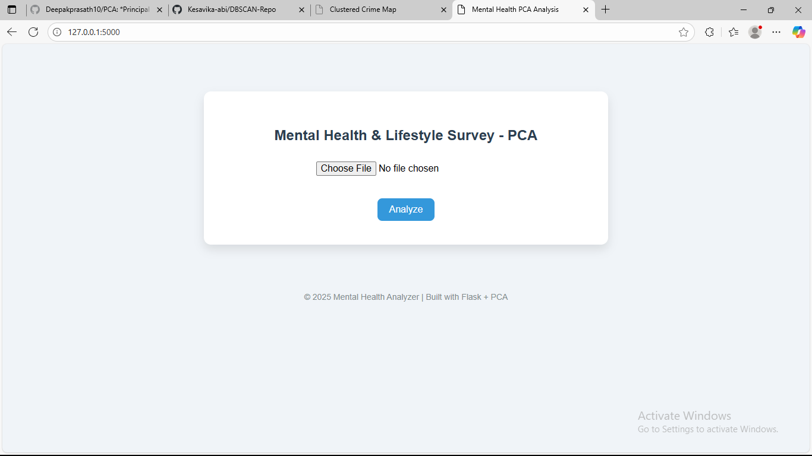
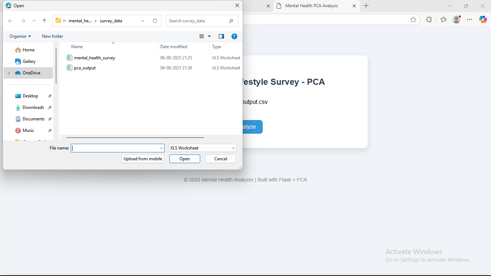
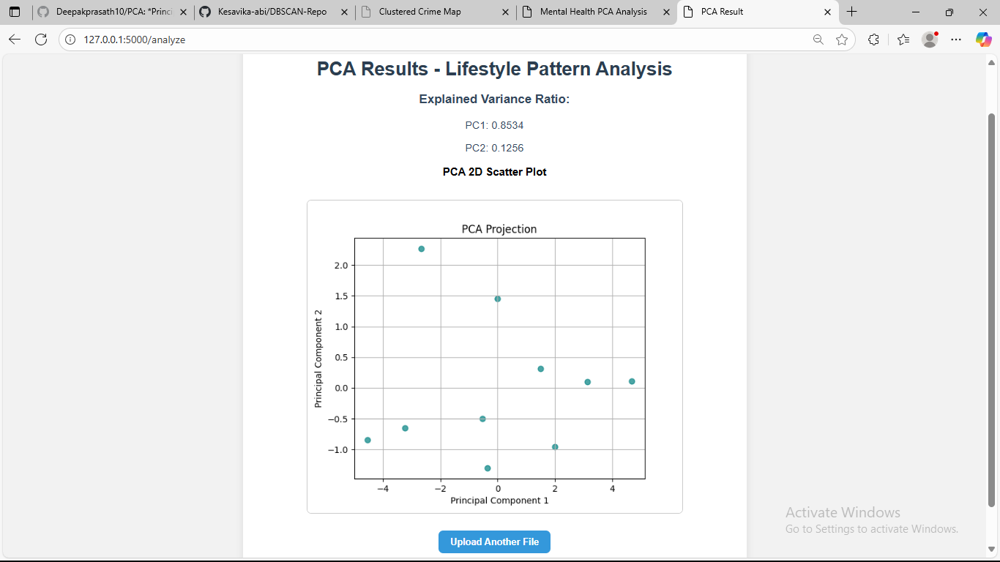

# Mental Health & Lifestyle Survey PCA

This project applies **Principal Component Analysis (PCA)** to survey data collected on students’ lifestyle habits (e.g., sleep time, screen time, stress levels, and diet). The goal is to reduce dimensionality, analyze hidden lifestyle patterns, and visualize clusters that may indicate wellness trends among college students.

## Folder Structure

## Objective

### To analyze lifestyle and mental health survey data using PCA to:

 - **Identify principal components affecting wellness**

 - **Reduce dimensions while retaining maximum variance**

 - **Visualize lifestyle patterns via 2D PCA scatter plots**

## Input

**File Format**: .csv

**Required Columns (example)**:

 -Sleep Hours

 -Stress Level

 -Screen Time

 -Diet Score

 -Social Interaction

## How It Works

1.User uploads a CSV via the web interface.

2.Backend:

-Loads and cleans the data.

-Standardizes the numeric features.

-Applies PCA (2 components).

3.Outputs:

-Explained Variance Ratio (PC1 & PC2)

-2D PCA Scatter Plot

4.The results are displayed on a results page.

## How to Run

## 1. Clone the Repository

git clone https://github.com/your-username/mental_health_pca.git
cd mental_health_pca

## 2. Install Dependencies

pip install -r requirements.txt
(If requirements.txt is not present, install manually:)

pip install flask pandas scikit-learn matplotlib

## 3. Run the App

python app.py
-Visit: http://127.0.0.1:5000/

-Upload your lifestyle survey .csv

-View the PCA results and plot

## Output Example

### Explained Variance Ratio

PC1: 0.56

PC2: 0.29

### PCA Plot

2D scatter plot of principal components

## Use Cases

 **College wellness program analysis**

 **Behavioral segmentation**

 **Lifestyle impact studies**

 **Dimensionality reduction for further ML tasks**

## Limitations

 **Assumes numeric input fields**

 **Designed for offline usage only (local app)**

 **Only supports 2 principal components visualization**

## Future Enhancements

 **Add scree plot and feature loadings**

 **Export PCA results to Excel**

 **Cluster segments after PCA using KMeans**

 ## Screenshots

 

 
 
 

